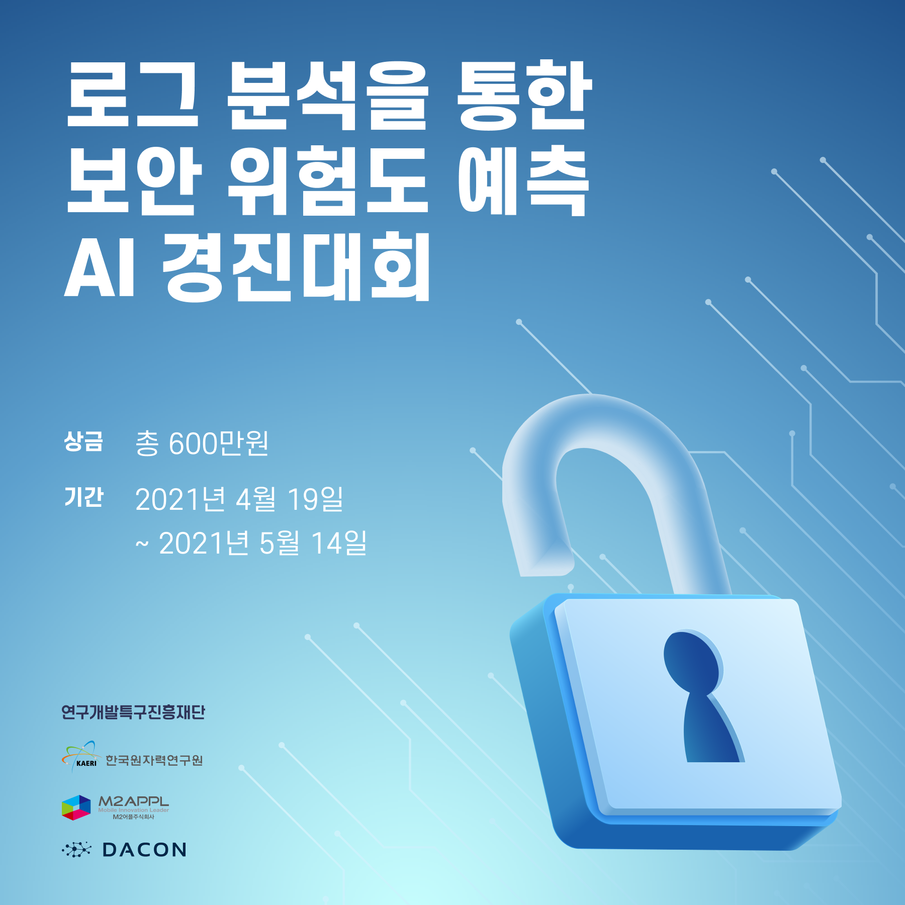

# 로그 분석을 통한 보안 위험도 예측 AI 경진대회

 

- [대회 바로가기](https://www.dacon.io/competitions/official/235717/overview/description/)

### **로그 분석을 통한 보안 위험도 예측 AI 경진대회 제작/운영 경과**

 

   

 

## 대회 소개 (Introduction)

### **1. 배경**

    
+ 새롭게 설치된 서버, NW 장비에서 발생되는 로그, 패킷에 대한 룰이 없으므로, 이에 대하여 인공지능으로 침해 위험도를 8단계로 분류하고자 합니다.  
+ 침해 위험도는 새로운 형태의 침해시에, 프로세스의 동작패턴, 명령어의 사용 종류가 달라지므로, 이에 대한 인공지능 침해탐지, 위험도를 분류해야합니다.
- 기존에 확인된 위험요소는 위험도를 0~6 7단계로 분류하였고 새로운 위험 요소를 위험도 7로하여 총 8단계 분류합니다.
- 인간은 두뇌와 신경을 통해 신체를 제어할 수 있습니다. 원자력 발전소도 이와 마찬가지로 각종 장비와 시설들을 제어하기 위한 두뇌와 신경망을 갖추고 있습니다.
- 원자력 발전소 도입 초기 아날로그였던 원전 계측·제어시스템이 디지털 시스템으로 변화하면서 사이버 테러라는 새로운 위협에 직면하게 되었습니다. 한국원자력연구원은 신종 사이버 공격에 신속하고 정확하게 대비하기 위한 연구를 수행하고 있습니다.

 

### 2. 주제

+ 로그 데이터를 통해 시스템의 보안 위험도 등급을 예측  
+ 기존에 없던 패턴의 공격 탐지

 

## 주최/주관

- 주최: 연구개발특구진행재단 / 한국원자력연구원(KAERI) / 엠투어플
- 주관: DACON

 

## 규칙

1. 심사 기준: [Macro F1](./0.%20Metric)
2. 외부 데이터 및 사전 학습 모델

* 외부 데이터 사용 前 토론 게시판에 문의 要

 

## 목차 (Table of Contents)

**개발 단계** - raw_data부터 대회용 데이터까지의 경과

1. [대회 개발](./1.%20Develop)
2. [대회 데이터 다운](https://www.dacon.io/competitions/official/235717/overview/description/)

 

**베이스라인** - 참여자들의 제출을 가능케하는 데이콘 베이스라인

3. [베이스라인](./3.%20Baseline)

 

**심화 코드**  

4. [심화 코드](./4.%20Answer_code)

